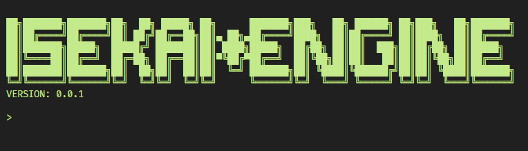

<p align="center">
    <a href="http://isekai.dev">
        
    </a>
    <br />
    <a href="https://travis-ci.org/isekai-dev/engine">
        
    </a>
    <a href="https://isekai.dev">
        
    </a>
    <a href="./LICENSE">
        
    </a>
    <a href="https://discord.gg/kc2nsTc">
        
    </a>
</p>

A different World.

## QUICK START
Requires node.js to be installed.

```
npm install -g isekai

isekai create <NAME OF YOUR WORLD>
isekai run <NAME OF YOUR WORLD>
```

Your world awaits at [http://localhost:8080]().

## TIPS AND TRICKS

Navigate to [http://localhost:8080/admin]() to play God with your world.

Your DATA directory can override anything in BIN/DATA. Use this to mod graphics and stuff.


## BUT WHAT DOES IT DO?
Isekai turns configuration TOML files into executable javascript bundles for either node or the browser.

ex:

```toml
[NODE]
[LOG]
[HTTP]
port = 8080

[HTTP_API]
[HTTP_PUBLIC]

# [[HTTP_MD]]
# path = "/"
# file = "README.md"
# template = "default.html
```

into
```js
import isekai from "isekai";
isekai.SET({"NODE":{},"LOG":{},"HTTP":{"port":8080},"HTTP_API":{},"HTTP_PUBLIC":{}});

import LOG from "../SHOP/LOG/index.js";
import HTTP from "../SHOP/HTTP/index.js";
import HTTP_API from "../SHOP/HTTP_API/index.js";
import HTTP_PUBLIC from "../SHOP/HTTP_PUBLIC/index.js";

isekai.EQUIP({
    LOG,
    HTTP,
    HTTP_API,
    HTTP_PUBLIC,
});
```

HTTP adds an express server APP onto the shared object as HTTP. HTTP_PUBLIC then serves a static HTTP website from the bag contents of HTTP_PUBLIC.

HTTP_PUBLIC.js
```js
import express from "express";

export default ({
    HTTP
}) => {
    HTTP.use(express.static(`../BAG/HTTP_PUBLIC`));
};
```

## BUT WHAT DOES IT REALLY DO?

isekai.js
```js
// Stare into the Abyss
const Isekai = ({
    SET: (obj) => 
        Object.entries(obj).
            forEach(([ key, value ]) => {
                Isekai[key] = Isekai[key] || {};
                
                if(typeof value === `function`) {
                    Isekai[key] = Object.assign(value, {
                        ...Isekai[key], 
                        ...value
                    });
                } else {
                    Isekai[key] = Object.assign(Isekai[key], value);
                }
            }),

    EQUIP: (obj) => 
        Object.entries(obj).
            forEach(([ key, fn ]) => {
                Isekai[key] = Isekai[key] || {};
                
                fn(Isekai); 
            })
});

export default Isekai;
```
