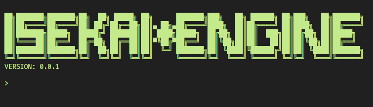

<p align="center">
    <a href="https://travis-ci.org/isekai-dev/engine">
        
    </a>
    <a href="./LICENSE">
        
    </a>
    <a href="https://discord.gg/kc2nsTc">
        
    </a>
</p>

A different World.

## QUICK START
Requires node.js to be installed.

```
npm install -g isekai

isekai create <NAME OF YOUR WORLD>
isekai run <NAME OF YOUR WORLD>
```

Your world awaits at [http://localhost:8080]().

## TIPS AND TRICKS

Navigate to [http://localhost:8080/admin]() to play God with your world.

Your DATA directory can override anything in BIN/DATA. Use this to mod graphics and stuff.

